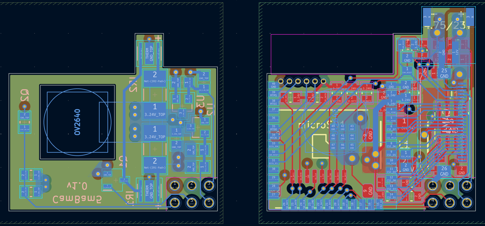
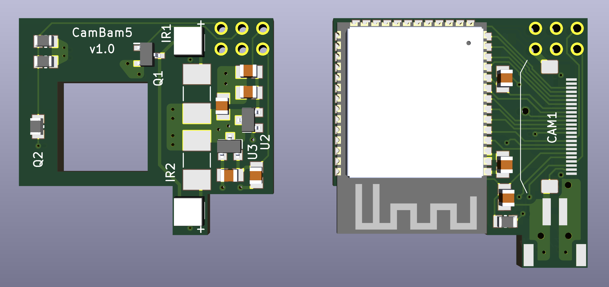
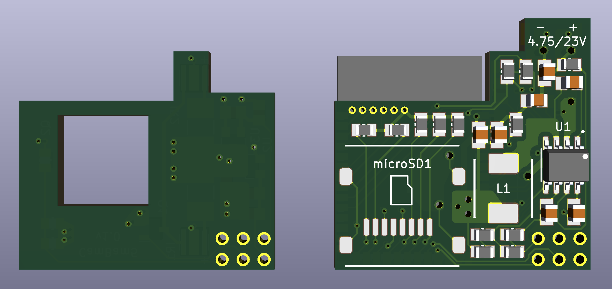

# CamBam5
Surveillance camera embedded device

CamBam5 is a surveillance camera embedded device. Voltage input can be from 4.75V up to 23V (12V standard) and is regulated down to 3.24V with the buck switching regulator. The system runs on the ESP32-S3 microcontroller which is embedded along with the infrared LEDs and phototransistor for the nightvision, OV2640 camera module with flat connector and its needed 2x LDO voltage level regulators, microSD card for the video storage, and can host the videos or the live feed via WiFi connection with the ESP32-S3 capabilities.

PCB design (4 layers)
:-------------------------:

PCB 3D top layer | PCB 3D bottom layer
:-------------------------:|:-------------------------:
 | 
